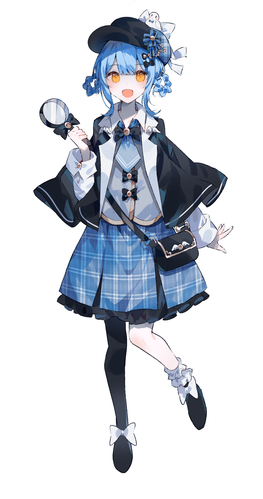

<table border="0" width="100%">
<tr>
<td width="65%" valign="top" style="border: none;">
<h1 align="center">Hi 👋, I'm OrionisLi</h1>

  
<ul style="list-style-type: none; padding: 0;">
<li>🔭 Working on: <b>A desk pet for ESP32S3</b></li>
<li>🌱 Learning: <b>ARM Linux, FreeRTOS & OpenMP</b></li>
<li>👯 Collaborating on: <a href="https://github.com/LubanCat"><b>LubanCat</b></a></li>
<li>📝 Writing posts at: <a href="https://posts.orionisli.cn"><b>posts.orionisli.cn</b></a></li>
<li>⚡ Fun fact: <b>I’m good at memes.</b></li>
<li>📫 Contact: <b>cyan2254650260@gmail.com</b></li>
</ul>
<h3 align="left">Connect with me:</h3>

</td>
<td width="35%" align="center" style="border: none;">

</td>
</tr>
</table>

<h3 align="center">🛠️ Languages and Tools</h3>

  <h4 style="margin-bottom: 10px;">Embedded & Linux</h4>
  
  
  
  
  
  

  <h4 style="margin-bottom: 10px;">AI & Data Science</h4>
  
  
  
  
  
  
  

  <h4 style="margin-bottom: 10px;">Web & Tools</h4>
  
  
  
  
  
  
  
  
   
  
  
  

 
